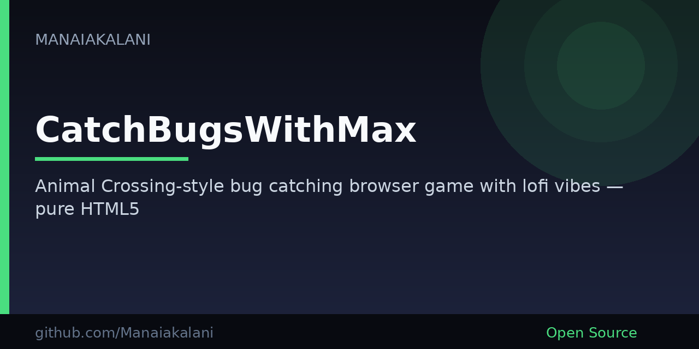

# 🦋 CatchBugsWithMax

**An Animal Crossing-style bug catching browser game.** Drift through a lofi garden, hover to scoop up critters with your net, and keep those corporate Sev 1 bombs out of production.

<p align="center">
  
</p>

**How to play:** move your cursor to guide the net (🥅) · hover a bug to catch it · hover a bomb (💣) and the garden becomes a Sev 1 incident.

## What / Why / Try it

| | |
| --- | --- |
| **What** | A cozy, zero-install bug catching game that lives in a single HTML page. Hover to catch. No clicks required. |
| **Why** | A tiny peaceful break — glassmorphism skies, fluttering emoji bugs, and work-life satire when a 💣 slips through the net. |
| **Try it** | Open [`index.html`](index.html) in any modern browser. No build, no account, no `npm install`. |

There is no GitHub Pages (or other documented live) URL for this project yet — clone or download the repo and open the file.

## 🎮 How to Play

1. **Guide the net** — your cursor *is* the net.
2. **Hover bugs** to catch them. Commons are 1 point; rares, ultra-rares, and secrets score more.
3. **Avoid bombs** (💣) or the session ends with a dreaded Sev 1 IcM.
4. **Grab power-ups** if they drift by: 🥇 golden net (2× points), 🧲 magnet (more rares), 🛡️ shield (bomb protection).
5. **Open the hamburger menu** (top-right) for dark mode and stats.

## ✨ Features

- **Hover-first controls** — accessibility-friendly catching, no click-spam
- **Dark mode** that remembers your choice (and fireflies after dusk)
- **Catch streaks**, rarity tiers, and a stats panel
- **Responsive glassmorphism UI** with drifting clouds and swaying trees
- **Corporate humor** — one bomb and it's a production incident
- **Pure web stack** — no frameworks, no dependencies, runs offline

## 🛠 Technologies

- **HTML5** — single-page game shell
- **CSS3** — animations, `backdrop-filter` glassmorphism, light/dark themes
- **JavaScript** — vanilla game loop, no libraries
- **Emojis** for the whole art set ✨
- Built with Claude Sonnet 4 as an AI assistant

## 🚀 Getting Started

Open `index.html` in any modern browser. That's the whole setup.

For a local server (optional):

```bash
python3 -m http.server 8000
# then visit http://localhost:8000
```

## 📁 Project Structure

```
/
├── index.html    # Game UI with embedded CSS
├── script.js     # Game logic and interactions
└── README.md     # You are here
```

---

*Made with ❤️ in Redmond, WA for peaceful moments and corporate chaos.*
